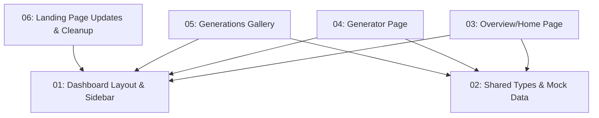

# Dashboard Redesign

## Overview

Replace the existing placeholder dashboard and standalone `/studio` with a polished, creator-focused dashboard experience. The dashboard features a collapsible sidebar (Linear/Framer-inspired), an overview/home page, an AI thumbnail generator within the dashboard shell, and a generations gallery. The old `/studio` route redirects to `/dashboard/generate`.

## Quick Links

- [Requirements](./requirements.md)
- [Action Required](./action-required.md)

## Dependency Graph

## Waves

| Wave | Tasks | Description |
|------|-------|-------------|
| 1 | task-01, task-02 | Foundation: layout shell + shared types (parallel, no deps) |
| 2 | task-03, task-04, task-05, task-06 | All page-level sections (parallel, deps on Wave 1) |

## Task Status

### Wave 1
- [x] [task-01-dashboard-layout-and-sidebar.md](./tasks/task-01-dashboard-layout-and-sidebar.md) — Dashboard app shell with collapsible sidebar navigation
- [x] [task-02-shared-types-and-mock-data.md](./tasks/task-02-shared-types-and-mock-data.md) — Domain types and placeholder datasets

### Wave 2
- [ ] [task-03-overview-page.md](./tasks/task-03-overview-page.md) — Overview/home page with stats, recent generations, quick actions
- [ ] [task-04-generator-page.md](./tasks/task-04-generator-page.md) — Full AI thumbnail generator with prompt, uploads, styles, preview
- [ ] [task-05-generations-page.md](./tasks/task-05-generations-page.md) — Thumbnail gallery grid page
- [ ] [task-06-landing-page-updates-and-cleanup.md](./tasks/task-06-landing-page-updates-and-cleanup.md) — Update CTAs, redirect /studio, remove old components
